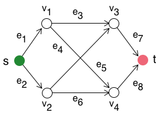

## Lab 10b: Calculating the Maximum Flow through a network using Linear Programming
In `Lab 10b`, students will become familiar with linear programming and calculating maximum flows through a graph using linear programming. 

Today, we'll consider the simple graph $\mathcal{G} = G(\mathcal{V},\mathcal{E})$:

### Background
Linear programs maximize (or minimize) a _linear_ objective function $\mathcal{O}$ subject to _linear_ constraints and bounds on the decision variables $x$ we are searching over; see [the course notes for more discussion of linear programming](https://varnerlab.github.io/CHEME-1800-Computing-Book/unit-3-learning/lp.html).

In chemical engineering, a significant application of linear programming is the maximum flow problems, i.e., finding the maximum possible flow through a network. This problem has many exciting applications, for example, calculating a system’s chemical reaction flux, or mass, energy flow. However, it also has other applications, such as matching problems, e.g., matching people to jobs, or products to machines, etc. 

The objective in a maximum flow calculation is to maximize the flow (or sum of flows) carried by an edge(s) in a network. The edges in the network have capacity constraints, i.e., lower and upper bounds on the amount of flux they can carry, and conservation constraints, i.e., for each node in the graph, the amount of flux entering has to equal the amount of flux leaving the node. 

### Prerequisites
* `Lab-10b` requires that the [JuMP](https://jump.dev/JuMP.jl/stable/) and [GLPK](https://github.com/jump-dev/GLPK.jl) packages be installed using the [Julia package manager included in the standard library](https://docs.julialang.org/en/v1/stdlib/Pkg/).

### Tasks
1. Start the Julia in the `Lab-10d` folder with the `--project=.` argument
1. Install required packages using the [Julia package manager](https://docs.julialang.org/en/v1/stdlib/Pkg/).
1. __Duration__ (15 minutes): Read the background materials and familiarize yourself with the files and functions in `Lab-10b`.
1. __Duration__ (10 minutes): Compute the maximum flow through the (default) toy network encoded in the `/data/Network.net` file by executing the `runme.jl` script. What is the solution?
1. __Duration__ (10 minutes): Compute the maximum flow through a modified network by changing the capacity fields in the edge records of the `/data/Network.net` file.  What is the solution now?
    1. Change the capacity of only edge 3 to `2.0`. Execute the `runme.jl` script, any changes?
    1. Change the capacity of edge 3 and edge 7 to `2.0`. Execute the `runme.jl` script, any changes?
