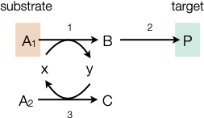

## Lab 10d: The Flux Balance Analysis and the Dual Problem
In `Lab 10d` students will become familiarized with flux balance analysis applications in chemical engineering and the interpretation of the dual problem in the context of flux balance analysis. 

### Background
Flux balance analysis (FBA) is an approach to estimate _flows_ through [trees and graphs](https://varnerlab.github.io/CHEME-1800-Computing-Book/unit-2-data/trees.html#trees), e.g., social graphs, communication networks, or other structures that can be represented as a network. Flux balance analysis is a type of [maximum flow problem](https://en.wikipedia.org/wiki/Maximum_flow_problem).  Today, let's consider the reaction scheme:

is occurring in a well-mixed reactor with a single input and a single output stream. Then, we can write the system of species mole balances at steady-state in matrix-vector form as:

$$
\mathbf{T}\dot{\mathbf{n}} + \mathbf{S}\dot{\mathbf{\epsilon}} = \mathbf{0}
$$

The matrix $\mathbf{T}$ is the $|\mathcal{M}| \times |\mathcal{M}||\mathcal{S}|$ _transport matrix_, the matrix $\mathbf{S}$ is the $|\mathcal{M}| \times |\mathcal{R}|$ _stoichiometric matrix_, $\dot{\mathbf{n}}$ denotes the $|\mathcal{M}||\mathcal{S}| \times {1}$ species flow vector and $\mathbf{\epsilon}$ denotes the $|\mathcal{R}| \times {1}$ reaction vector. In this case, let's define $\dot{\mathbf{n}}$ as:

$$
\dot{\mathbf{n}} \equiv
\left(
    \dot{n}_{A_{1},1}, \dot{n}_{A_{2},1}, \dot{n}_{B,1}, \dot{n}_{C,1}, \dot{n}_{P,1}, \dot{n}_{x,1},\dot{n}_{y,1},
    \dot{n}_{A_{1},2}, \dot{n}_{A_{2},2}, \dot{n}_{B,2}, \dot{n}_{C,2}, \dot{n}_{P,2}, \dot{n}_{x,2},\dot{n}_{y,2}
\right)
$$

This is an _undetermined problem_ in the sense that we have 17 unknowns (the flow rates and the reaction extents) and only 7 equations (the species mole balances; $7\times{17}$ system). However, linear programming can be used to explore the properties of this underdetermined system, even if we have no information.

### Prerequisites
* `Lab-10d` requires that the [JuMP](https://jump.dev/JuMP.jl/stable/) and [GLPK](https://github.com/jump-dev/GLPK.jl) packages be installed using the [Julia package manager included in the standard library](https://docs.julialang.org/en/v1/stdlib/Pkg/).

### Tasks
1. Start the Julia in the `Lab-10d` folder with the `--project=.` argument
1. Install any required packages using the [Julia package manager](https://docs.julialang.org/en/v1/stdlib/Pkg/).
1. __Duration__ (20 minutes): Read the background materials and familiarize yourself with the files and functions in `Lab-10b`, particularly the `runme-primal.jl` script. This lab borrows heavily from `Lab 7b`.
1. __Duration__ (10 minutes): Execute the `runme-primal.jl` script with the default values for the bounds (see the `bounds_array` on `L39`). Was an optimal solution found (execute the `solution_summary(model)` command), and if so, what is the solution suggesting we do?
1. __Duration__ (10 minutes): Execute the `runme-primal.jl` script with the bounds $10.0\leq\dot{n}_{A1,1}\geq{10.0}$ and $0.0\leq\dot{n}_{B,1}\geq{0.0}$  (see the `bounds_array` on `L39`). What is the meaning of these constraints, and the solution obtained?
1. __Duration__ (10 minutes): What bounds do we have to change to get flux through reaction 3? Implement your strategy. Does it work?

